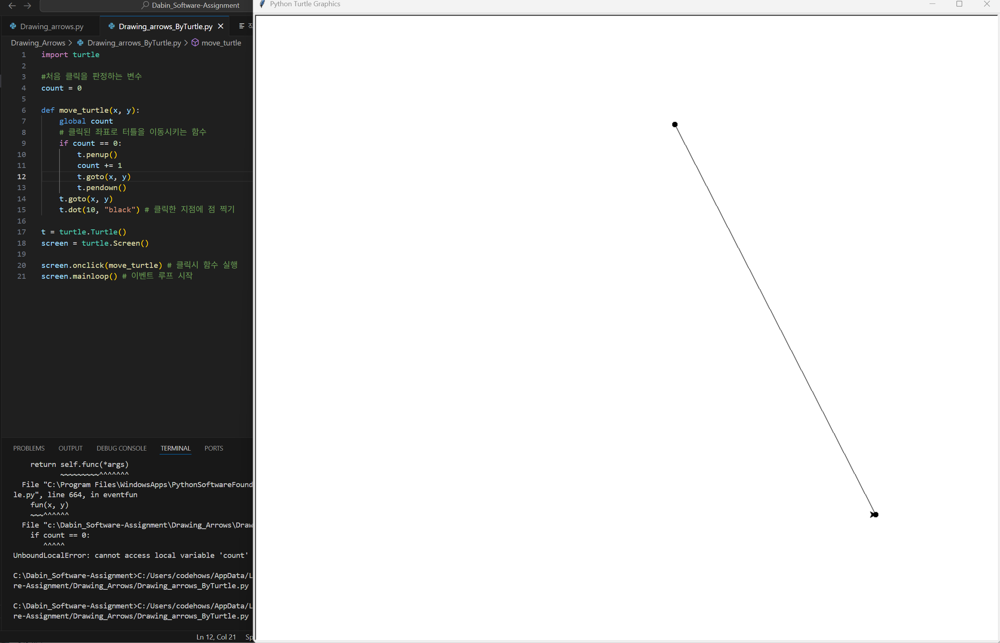
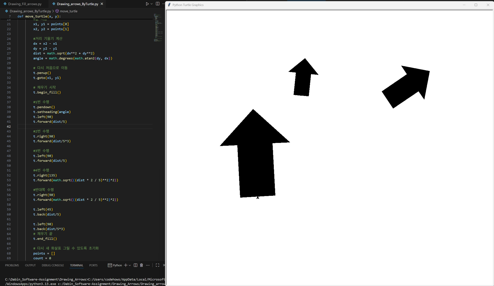
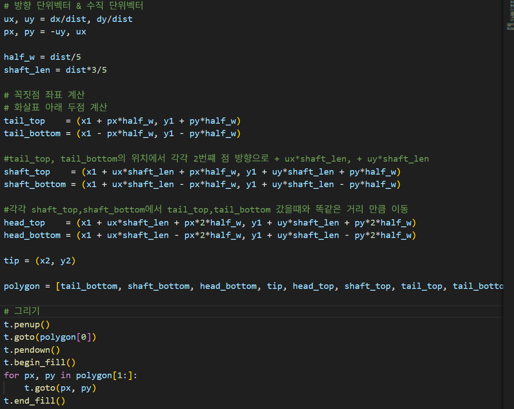
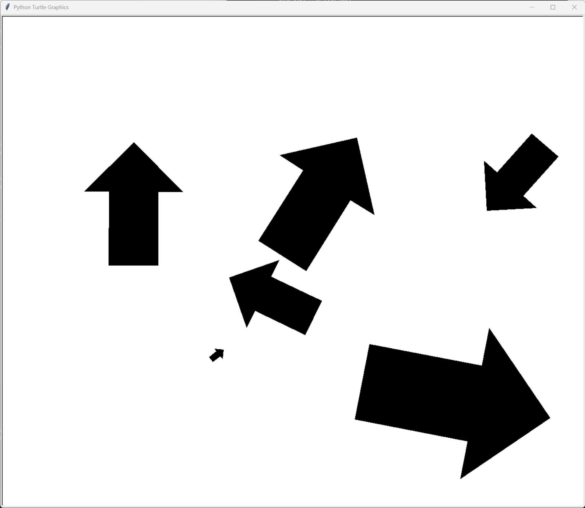

# 작업한 히스토리 2025.08.25~

1. 기존 선 그리는 라이브러리 turtle을 사용하기 위해 작업 언어 파이썬으로 선택

2. Turtle을 import 받아 점을 찍은 후 다음 점을 찍으면 두 점 사이를 잇는 선 그리기
   

3. 두 점 사이의 거리를 구하기 위해 math 라이브러리 import 후 화살표 그리기 로직 생각

   1. 두점의 좌표 저장
   2. 2.에서 그렸던 두점 사이의 선의 거리와 각도(기울기) 계산
   3. 어림잡아 1차 구현
       1-> 2-> 3-> 4 순으로 진행할거라 생각

      1. 계산된 기울기에서 좌로 90° 회전 후 직선거리의 1/4 만큼 선을 긋는다.
      2. 다시 우로 90° 회전 후 직선거리의 2/3 만큼 선을 긋는다.
      3. 다시 좌로 90° 회전 후 직선거리의 1/4 만큼 선을 긋는다.
      4. 3의 점에서 기존 도착점 까지 회전 후 계산 -- 이부분이 값이 편하게 떨어지지 않아 각각 수치 다시 생각

   4. 값을 다시 생각해서 수정

      1. 계산된 기울기에서 좌로 90° 회전 후 직선거리의 1/5 만큼 선을 긋는다.
      2. 다시 우로 90° 회전 후 직선거리의 3/5 만큼 선을 긋는다.
      3. 다시 좌로 90° 회전 후 직선거리의 1/5 만큼 선을 긋는다.
      4. 다시 우로 135° 회전 후 직선거리의 2√2/5 만큼 선을 긋는다.
      5. 2번째 점에 도착 예상
          화살표 반쪽 그리기 완료

   5. 나머지 반쪽 그리기 구현후 색 채우기
      

4. 화살표는 만들었지만 수식을 활용하여 다시 구현
   1. 3에서 그렸던 화살표의 꼭짓점들을 수식으로 표현
      
   2. 구현 완료 후 테스트
      
