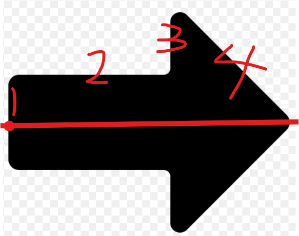

1. 기존 선 그리는 라이브러리 turtle을 사용하기 위해 작업 언어 파이썬으로 선택

2. Turtle을 import 받아 점을 찍은 후 다음 점을 찍으면 두 점 사이를 잇는 선 그리기
   

3. 두 점 사이의 거리를 구하기 위해 math 라이브러리 import 후 화살표 그리기 로직 생각
   1. 두점의 좌표 저장
   2. 2.에서 그렸던 두점 사이의 선의 거리와 각도(기울기) 계산
   3. 어림잡아 1차 구현
       1-> 2-> 3-> 4 순으로 진행할거라 생각

. 마우스 클릭 좌표를 가져오기 위한 pynput 라이브러리 install

. 마우스 클릭시 좌표값 가져오기 구현

