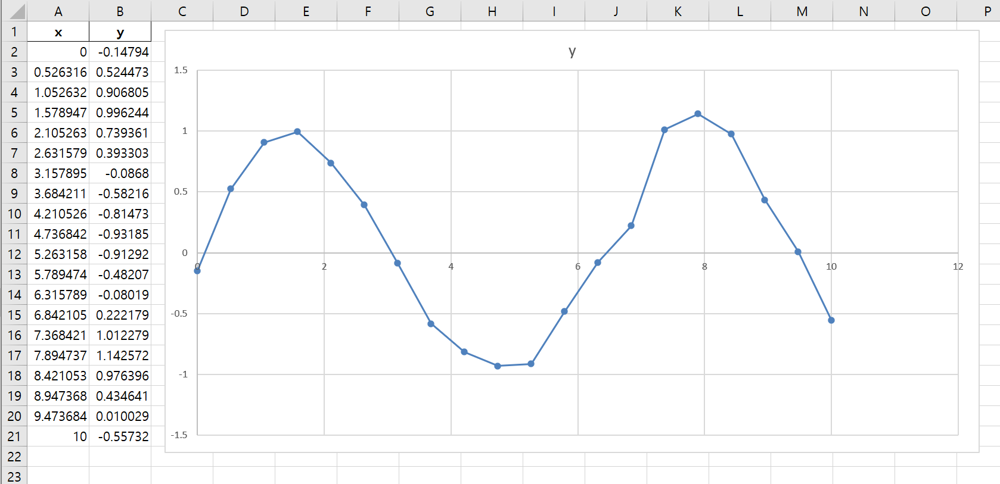
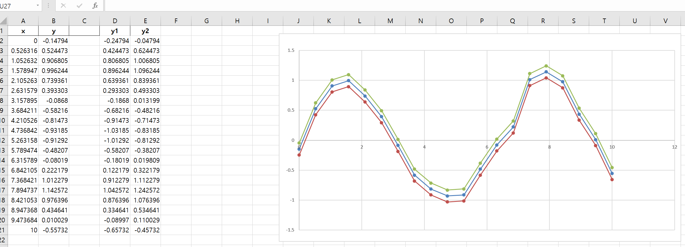
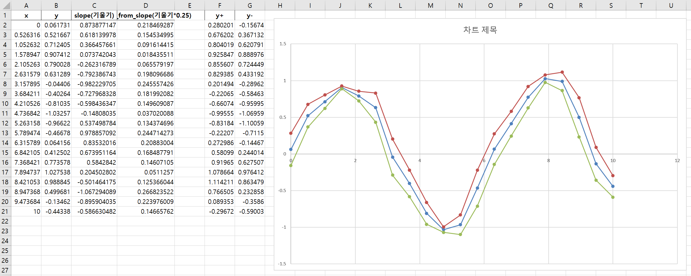
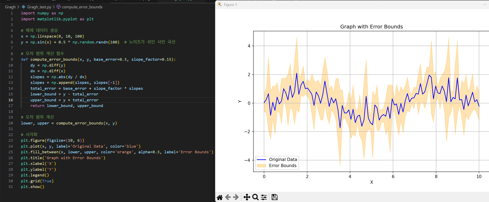
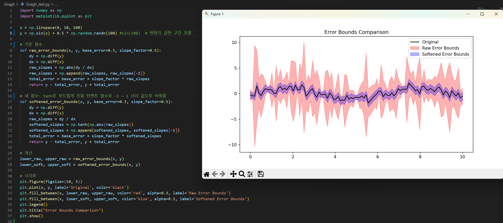

# 그래프 오차범위 그리기 작업 히스토리

1. 면접 때 코멘트 주셨던대로 y값 +-로 구현 x

2. 각각의 기울기를 구해 기울기에 따른 유사도 구현 생각

3. 일단 샘플 데이터 생성 후 그래프 보고 다시 생각 - Ai활용해 생성
   

4. y값 +-0.1 한 값으로 그래프 생성
   
   단점: 값이 튀었을 떄 범위가 이상하게 측정됨

5. 기울기 값에 따른 y값 +- 변경 방법으로 그래프 생성
   
   단점 기울기가 완만해질때 너무 범위가 좁아짐

6. 두 방법을 합쳐서 기본 값을 준 후 기울기에 따라 값을 추가하는 방법으로 그래프 생성
   액셀 -> python 코드로 랜덤값 생성 후 그래프 시각화
   

7. 6에서 그래프의 중간중간 값이 너무 뾰족하게 나와서 np.tanh 함수를 활용해 튀는 값 조정
   
